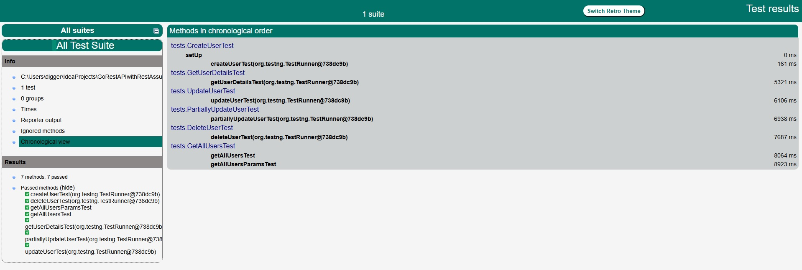

# Project Title
GoRestAPIwithRestAssured

## Table of contents
* [Description](#description)
* [Report](#report)
* [Technologies, languages and frameworks](#technologies-languages-and-frameworks)
* [Setup](#setup)

## Description
This is a simple project that demonstrate how to automate API testing https://gorest.co.in/
The tests included in the project verify the following features:
- Create a user (POST request)
- Get user details (GET request)
- Update user details (PUT request)
- Partially update user details (PATCH request)
- Get all users (GET request)
- Delete a user (DELETE request)

## Report

## Technologies, languages and frameworks
Project is created with:
* Rest Assured
* Java
* Maven
* TestNG

## Setup
### Prerequisites
Before running the program install:
* Java 11 or higher
* IntelliJ IDEA

### Executing program
* Clone the repo https://github.com/SashaGencheva/GoRestAPI-RestAssured.git
* Open the project in IntelliJ IDEA
* Run testng.xml file